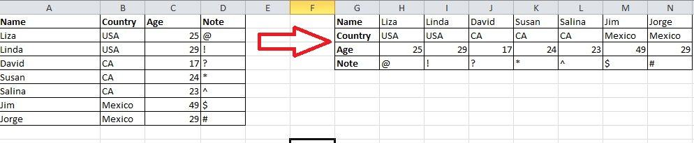
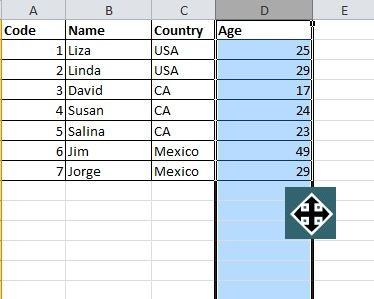
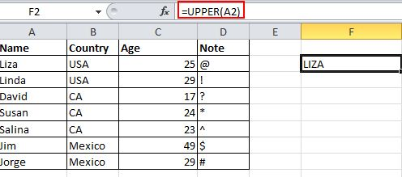
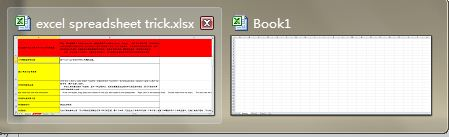
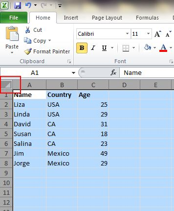
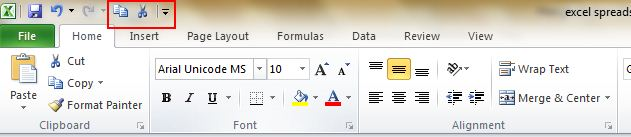
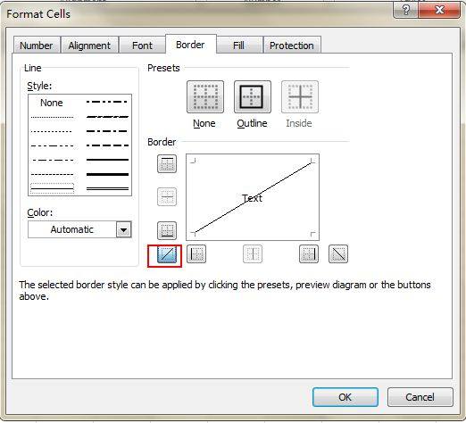
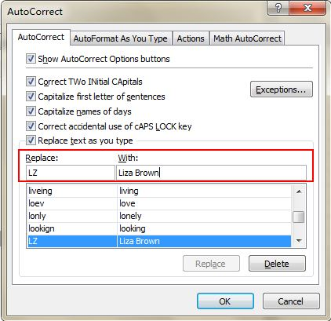
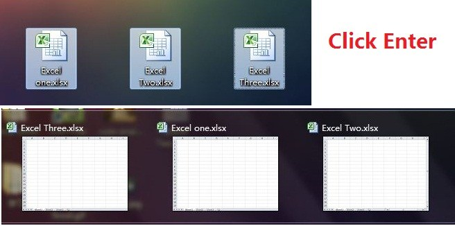

# Top-10-Excel-Tips-and-Tricks-2019

## Trick # 1 : Transpose Data from a Row to a Column

You would use this feature if you want to transpose data to get a better display; however, retyping all data would be the last thing you would need to do if you know how to use the Transpose function in Paste. Here’s how: copy the area you want to transpose, move the pointer to another blank location. Go to Home->Paste->Transpose, please note that this function won’t activate until you copy the data first. 

## Trick # 2 : Speedily Move and Copy Data in Cells

If you want to move one column of data in a spreadsheet, the fast way is to choose it and move the pointer to the border, after it turns to a crossed arrow icon, drag to move the column freely. What if you want to copy the data? You can press the Ctrl button before you drag to move; the new column will copy all the selected data.   

## Trick # 3 : Transforming the Case of Text

There are still some simple and easy to use formulations to show you, like UPPER, LOWER and PROPER, which can transform texts for different purposes. UPPER will capitalize all characters, LOWER can change text to all lower case and PROPER will only capitalize the first character of a word.    

## Trick # 4 : Shift Between Different Excel Files

When you have different spreadsheets open, it’s really annoying shifting between different files because sometimes working on the wrong sheet can ruin the whole project. Using Ctrl + Tab you can shift between different files freely. This function is also applicable to other files like different Windows tabs in Firefox when opened using Windows 7.     

## Trick  # 5 : One Click to Select All

You might know how to select all by using the Ctrl + A shortcut, but few know that with only one click of the corner button, as shown in the screenshot below, all data will be selected in seconds.    

## Trick # 6 : Create a New Shortcut Menu

Generally there are three shortcuts in the top menu, which are Save, Undo Typing and Repeat Typing. However, if you want to use more shortcuts, like Copy and Cut, you can set them up as follows:      

File->Options->Quick Access Toolbar, add Cut and Copy from the left column to the right, save it. You will see two more shortcuts added in the top menu.

## Trick # 7 : Add a Diagonal Line to a Cell

When creating a classmate address list, for example, you may need a diagonal link in the first cell to separate different attributes of rows and columns. How to make it? Everyone knows that Home->Font-> Borders can change different borders for a cell, and even add different colors. However, if you click More Borders, you will get more surprises, like a diagonal line. Click it and save—you can now make it immediately.  

## Trick # 8 : Speed up Inputting Complicated Terms with AutoCorrect

If you need to repeat the same value and it is complicated to input, the best way is to use the AutoCorrect function, which will replace your text with the correct text. Take my name, Liza Brown, for example, which can be replaced by LZ. Therefore, every time I input LZ, it can autocorrect to Liza Brown. Go to File->Options->Proofing->AutoCorrect Options and input Replace text with correct text in the red rectangular area, as below.   

## Trick # 9 : Fast Navigation with Ctrl + Arrow Button

When you click Ctrl + any arrow button on the keyboard, you can jump to the edge of the sheet in different directions. If you want to jump to the bottom line of the data, just try to click Ctrl + downward button.  

## Trick # 10 : Open Excel Files in Bulk

Rather than open files one by one when you have multiple files you need to handle, there is a handy way to open them all with one click. Select the files you would like to open then press the Enter key on the keyboard, all files will open simultaneously.   
 
 

# For more useful articles or blogs visit our website:
https://www.mobitsolutions.com/blog

# About Us:
<B>wordpress website design | wordpress theme development | wordpress designer</b>

https://www.mobitsolutions.com/website-design-development/

# Video Tutorial:
https://youtu.be/A2ySIATBcV4
